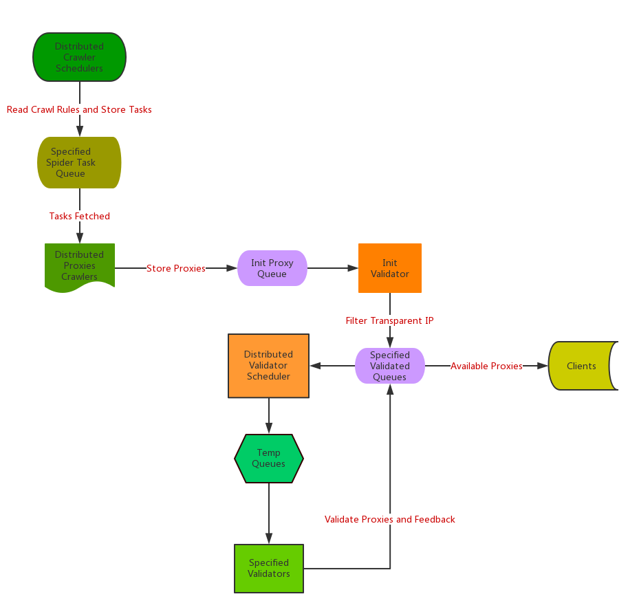

# HAipproxy
[README](README_EN.md)　｜　[中文文档](README.md)

本项目所采集的IP资源都来自互联网，愿景是为大型爬虫项目提供一个**高可用低延迟的高匿IP代理池**。

# Features
- 快速抓取代理IP
- IP抓取和提取精准
- IP来源丰富
- 优良的IP校验器，并且容易根据自身需要扩展
- 支持分布式部署
- 架构设计灵活
- MIT授权协议

# Quick start

注意，代码请在[release](https://github.com/SpiderClub/haipproxy/releases)列表中下载，**master**分支的代码不保证能稳定运行

## 单机部署

### 服务端
- 安装Python3和Redis。有问题可以阅读[这篇文章](https://github.com/SpiderClub/weibospider/wiki/%E5%88%86%E5%B8%83%E5%BC%8F%E7%88%AC%E8%99%AB%E7%8E%AF%E5%A2%83%E9%85%8D%E7%BD%AE)的相关部分。
- 根据Redis的实际配置修改项目配置文件[config/settings.py](config/settings.py)中的`REDIS_HOST`、`REDIS_PASSWORD`等参数。
- 安装[scrapy-splash](https://github.com/scrapy-plugins/scrapy-splash)，并修改配置文件[config/settings.py](config/settings.py)中的`SPLASH_URL`
- 安装项目相关依赖
  > pip install -r requirements.txt
- 启动*scrapy worker*，包括代理IP采集器和校验器
  > python crawler_booter.py --usage crawler

  > python crawler_booter.py --usage validator
- 启动*调度器*，包括代理IP定时调度和校验
  > python scheduler_booter.py --usage crawler

  > python scheduler_booter.py --usage validator

### 客户端
近日不断有同学问，如何获取该项目中可用的代理IP列表。`haipproxy`提供代理的方式并不是通过`web api`来提供，而是通过具体的客户端来提供。
目前支持的是[Python客户端](client/py_cli.py)和语言无关的[squid二级代理](client/squid.py)

#### python客户端调用示例 
```python3
from client.py_cli import ProxyFetcher
args = dict(host='127.0.0.1', port=6379, password='123456', db=0)
＃　这里`zhihu`的意思是，去和`zhihu`相关的代理ip校验队列中获取ip
＃　这么做的原因是同一个代理IP对不同网站代理效果不同
fetcher = ProxyFetcher('zhihu', strategy='greedy', redis_args=args)
# 获取一个可用代理
print(fetcher.get_proxy())
# 获取可用代理列表
print(fetcher.get_proxies()) # or print(fetcher.pool)
```

更具体的示例见[examples/zhihu](examples/zhihu/zhihu_spider.py)

#### squid作为二级代理
- 安装squid，备份squid的配置文件并且启动squid，以ubuntu为例
  > sudo apt-get install squid

  > sudo sed -i 's/http_access deny all/http_access allow all/g'

  > sudo cp /etc/squid/squid.conf /etc/squid/squid.conf.backup

  > sudo service squid start
- 根据操作系统修改项目配置文件[config/settings.py](config/settings.py)中的`SQUID_BIN_PATH`、`SQUID_CONF_PATH`、`SQUID_TEMPLATE_PATH`等参数
- 启动`squid conf`的定时更新程序
  > sudo python squid_update.py
- 使用squid作为代理中间层请求目标网站,默认代理URL为'http://squid_host:3128',用Python请求示例如下
  ```python3
  import requests
  proxies = {'https': 'http://127.0.0.1:3128'}
  resp = requests.get('https://httpbin.org/ip', proxies=proxies)
  print(resp.text)
  ```
   
## Docker部署
- 安装Docker

- 安装*docker-compose*
  > pip install -U docker-compose

- 修改[settings.py](config/settings.py)中的`SPLASH_URL`和`REDIS_HOST`参数
  ```python3
  SPLASH_URL = 'http://splash:8050'
  REDIS_HOST = 'redis'
  ```
- 使用*docker-compose*启动各个应用组件
  > docker-compose up

这种方式会一同部署`squid`，您可以通过`squid`调用代理IP池，也可以使用客户端调用，和单机部署调用方式一样

# 注意事项
- 本项目高度依赖Redis，除了消息通信和数据存储之外，IP校验和任务定时工具也使用了Redis中的多种数据结构。
如果需要替换Redis，请自行度量
- 由于*GFW*的原因，某些网站需要通过科学上网才能进行访问和采集，如果用户无法访问墙外的网站，请将[rules.py](config/rules.py)
`task_queue`为` SPIDER_GFW_TASK`和`SPIDER_AJAX_GFW_TASK`的任务`enable`属性设置为0或者启动爬虫的时候指定爬虫类型为`common`和
`ajax`
  > python crawler_booter.py --usage crawler common ajax
- 相同代理IP，对于不同网站的代理效果可能大不相同。如果通用代理无法满足您的需求，您可以[为特定网站编写代理IP校验器](https://github.com/SpiderClub/haipproxy/blob/master/docs/%E9%92%88%E5%AF%B9%E7%89%B9%E5%AE%9A%E7%AB%99%E7%82%B9%E6%B7%BB%E5%8A%A0%E6%A0%A1%E9%AA%8C%E5%99%A8.md)

# 工作流程


# 开发者文档
为了方便用户针对自身需求进行定制化，`haipproxy`提供了丰富的文档支持。所有文档详见[项目wiki](https://github.com/SpiderClub/haipproxy/wiki)

# 效果测试
以单机模式部署`haipproxy`和[测试代码](examples/zhihu/zhihu_spider.py)，以知乎为目标请求站点，
每一万条成功请求为统计结果，实测抓取效果如下

|请求量|时间|耗时|IP负载策略|客户端|
|-----|----|---|---------|-----|
|0|2018/03/03 22:03|0|greedy|[py_cli](client/py_cli.py)|
|10000|2018/03/03 11:03|1 hour|greedy|[py_cli](client/py_cli.py)|
|20000|2018/03/04 00:08|2 hours|greedy|[py_cli](client/py_cli.py)|
|30000|2018/03/04 01:02|3 hours|greedy|[py_cli](client/py_cli.py)|
|40000|2018/03/04 02:15|4 hours|greedy|[py_cli](client/py_cli.py)|
|50000|2018/03/04 03:03|5 hours|greedy|[py_cli](client/py_cli.py)|
|60000|2018/03/04 05:18|7 hours|greedy|[py_cli](client/py_cli.py)|
|70000|2018/03/04 07:11|9 hours|greedy|[py_cli](client/py_cli.py)|
|80000|2018/03/04 08:43|11 hours|greedy|[py_cli](client/py_cli.py)|


可见`haipporxy`的代理效果还算不错，在开始的时候可以达到`1w/hour`的请求量，几个小时候请求量请求量
降为了`5k/hour`。降低的结果可能有三个: (1)随着数据量的增大,Redis的性能受到了一定的影响(2)知乎校验
器在把`Init Queue`中的代理消费完之后，由于是定时任务，所以导致某段时间内新鲜的IP空缺。而免费IP大多
数都是短效的，所以这段时间出现了IP的空缺;(3)由于我们采用的是`greedy`模式调用IP，它的调用策略是: 高
质量代理IP会一直被调用直至该代理IP不能用或者被封，而低应速度IP会轮询调用。这也可能导致高质量IP的空缺。

由此可见IP校验和调用策略还有很大的优化空间。希望能有志同道合的朋友加入进来一起优化。

测试代码见[examples/zhihu](examples/zhihu/zhihu_spider.py)

# 如何贡献
- 欢迎给项目提新feature
- 如果发现项目某些环节有问题，欢迎提issue或者PR
- 代理IP校验和筛选的策略仍有优化的空间，欢迎大家交流探讨
- 如果你发现了比较好的代理网站，欢迎分享

# 同类项目参考
本项目参考了Github上开源的各个爬虫代理的实现，感谢他们的付出，下面是笔者参考的所有项目，排名不分先后。

[dungproxy](https://github.com/virjar/dungproxy)

[proxyspider](https://github.com/zhangchenchen/proxyspider)

[ProxyPool](https://github.com/henson/ProxyPool)

[proxy_pool](https://github.com/jhao104/proxy_pool)

[ProxyPool](https://github.com/WiseDoge/ProxyPool)

[IPProxyTool](https://github.com/awolfly9/IPProxyTool)

[IPProxyPool](https://github.com/qiyeboy/IPProxyPool)

[proxy_list](https://github.com/gavin66/proxy_list)

[proxy_pool](https://github.com/lujqme/proxy_pool)

