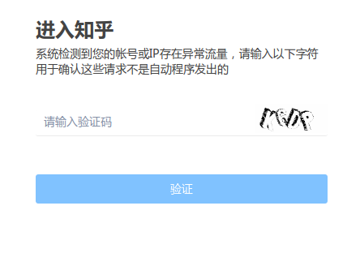

使用过代理IP的同学应该都知道，即使是同一个IP，访问不同网站，可用性和速度都可能大不相同。因此，根据实际使用情况编写特定站点的代理校验器是非常必要的。本文介绍扩展[haipproxy](https://github.com/SpiderClub/haipproxy)的校验器方法，为了方便阐述，下面我们以[zhihu.com](https://www.zhihu.com/)为例进行说明。

---
1.在[settings.py](https://github.com/SpiderClub/haipproxy/blob/master/config/settings.py)中添加`zhihu`校验器对应的`temp queue`、`validated queue`、`ttl queue`及`speed queue`。`temp queue`的作用是作为临时队列存储下一次定时校验的任务，`validated queue`是已经校验过的任务，记录了对应代理IP的打分(成功率)，`ttl queue`是对应代理IP最近一次的校验时间，`speed queue`记录的是对应代理IP最近一次校验的响应速度，后面三个队列都会作为客户端获取代理IP需要考虑的因素。这里我将四者分别设置为
```python3
TEMP_ZHIHU_QUEUE = 'haipproxy:zhihu:temp'
VALIDATED_ZHIHU_QUEUE = 'haipproxy:validated:zhihu'
TTL_ZHIHU_QUEUE = 'haipproxy:ttl:zhihu'
SPEED_ZHIHU_QUEUE = 'haipproxy:speed:zhihu'
```

2.将上一步的`queue`配置到[rules.py](https://github.com/SpiderClub/haipproxy/blob/master/config/rules.py)中对应的maps中
```python3
TEMP_TASK_MAPS = {
    # temp task maps 中init queue必须存在
    'init': INIT_HTTP_QUEUE,
    'zhihu': TEMP_ZHIHU_QUEUE
}
SCORE_MAPS = {
    'zhihu': VALIDATED_ZHIHU_QUEUE
}
TTL_MAPS = {
    'zhihu': TTL_ZHIHU_QUEUE
}
SPEED_MAPS = {
    'zhihu': SPEED_ZHIHU_QUEUE
}
```
3.在[校验器模块](https://github.com/SpiderClub/haipproxy/blob/master/crawler/validators)添加知乎校验器爬虫，具体流程如下
- 新建校验器爬虫文件`zhihu.py`,在其中添加校验具体逻辑
```
from config.settings import (
    TEMP_ZHIHU_QUEUE, VALIDATED_ZHIHU_QUEUE,
    TTL_ZHIHU_QUEUE, SPEED_ZHIHU_QUEUE)
# ValidatorRedisSpider提供了分布式父类爬虫
from ..redis_spiders import ValidatorRedisSpider
# BaseValidator提供了基本的请求错误处理，但是业务相关逻辑错误需要自己实现
from .base import BaseValidator

class ZhiHuValidator(BaseValidator, ValidatorRedisSpider):
　  # scrapy爬虫名，必须设置且不能与已知的重复
    name = 'zhihu'
    # 需要验证的URL，建议选择一个稳定且有代表意义的url，数据结构是一个list
    urls = [
        'https://www.zhihu.com/question/47464143'
    ]
    # 下面四个属性必须设置，并且与maps中的一致
    task_queue = TEMP_ZHIHU_QUEUE
    score_queue = VALIDATED_ZHIHU_QUEUE
    ttl_queue = TTL_ZHIHU_QUEUE
    speed_queue = SPEED_ZHIHU_QUEUE
    # 判断success_key是否在响应内容中，从而判断IP是否正常，默认为''，表示正常
    success_key = ''
```

- 常规校验器到上一步就完成了，如果有和业务相关的验证逻辑，比如在IP被封的时候返回的状态码仍是`200`。这个时候依靠[BaseValidator](https://github.com/SpiderClub/haipproxy/blob/master/crawler/validators/base.py)的`parse_error`方法是不够的。因为`BaseValidator`只会筛选不能用的代理IP。这里不能用的标准是HTTP状态码是非`2xx`或者`3xx`。但是某些网站如微博和知乎，在封IP后仍然给客户端返回的是`200`状态码，所以我们还可能需要**提取页面的一些特征来判断该代理IP是否可用**。比如知乎在判断出IP有风险的时候，会弹出以下提示


我们可以查看页面源码，在`title`中提取出`安全验证`这个比较特殊的标记，它可以作为判断IP是否被屏蔽的标准，如果怕误判，我们还可以提取如`verification`等关键词来加强判断逻辑。这种方式需要实测让IP被屏蔽之后才能实现相关逻辑。另一种方式是我们设置一个预期成功的标记`success_flag`,比如[https://www.zhihu.com/question/47464143](https://www.zhihu.com/question/47464143)这个url,我们先通过正常情况下爬虫访问获取到它的返回结果，然后找一个特殊的字符串作为成功返回的标记，这里我选`爬虫`这个字符串，我们再设置`ZhiHuValidator`的`success_key＝爬虫`即可。同时，你也可以强化该场景的校验方法，在`ZhiHuValidator`中重写`BaseValidator`的父方法`is_ok(self, response)`，举一个简单的例子
   ```python3
    def is_ok(self, response):
        return True if self.success_key in response.text and 'python' in response.text else False
   ```

到这里，我们便完成`zhihu`校验器的编写了。

---
配合该校验器抓取知乎的简要说明如下
- 先启动代理抓取爬虫和定时任务调度器(这里我只启动了`common`这个代理抓取任务)
  > python crawler_booter.py --usage crawler common

  > python scheduler_booter.py --usage crawler common

- 再启动`zhihu`和`init`校验器和定时任务调度器
  > python crawler_booter.py --usage validator init zhihu

  > python scheduler_booter.py --usage validator zhihu

- 调用代理IP客户端实现数据采集

如果代理IP使用过程有不清楚的请查看[haipproxy具体使用说明]()